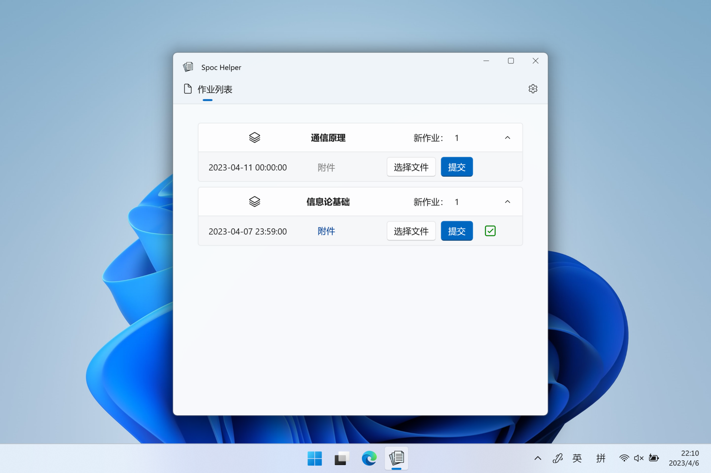



    

<h1 align="center" style="font-weight: bold">
  Spoc 助手
</h1>

  

  优雅地使用Spoc！

## 📑 简介

Spoc 助手是一款基于 WinUI 3 的 Windows 10/11 应用，能够让 BUAAers 优雅地完成作业查看和提交。

## 🥳 使用

- 🌐 通过微软商店下载本应用：[Spoc 助手](https://apps.microsoft.com/store/detail/9PM0GCZ6ZD53?launch=true&mode=full)
- 🐼 使用统一认证账号登录（你的账号信息将仅保存在本地😊）
- 🎉 查看作业并提交
  
> 注：应用提交到微软商店之后需要2-3天时间才能通过审核，因此商店版更新会较慢。如果你希望体验最新功能，可以选择从 [Action](https://github.com/FuryMartin/BUAA-SpocHelper/actions) 中下载侧加载版。初次使用侧载版需要使用 `install.ps1` 添加证书。

## 🤔 问题和建议？

请在 [Issue](https://github.com/FuryMartin/BUAA-SpocHelper/issues) 页面描述你所遇到的问题与建议。

## ❤️ 致谢

🧑‍💻 代码参考：
- [EnergyStarX - JasonWei512](https://github.com/JasonWei512/EnergyStarX)
- [MVVMSourceGenerators - jamesmontemagno](https://github.com/jamesmontemagno/MVVMSourceGenerators)
- [WinUI-Gallery - Microsoft](https://github.com/microsoft/WinUI-Gallery)

🍀 图标：
- [Paper icon created by Freepik - Flaticons](https://www.flaticon.com/free-icon/paper_2541988)
- [All-Done icon created by gungyoga04 - Flaticons](https://www.flaticon.com/free-icon/approved_4817167)